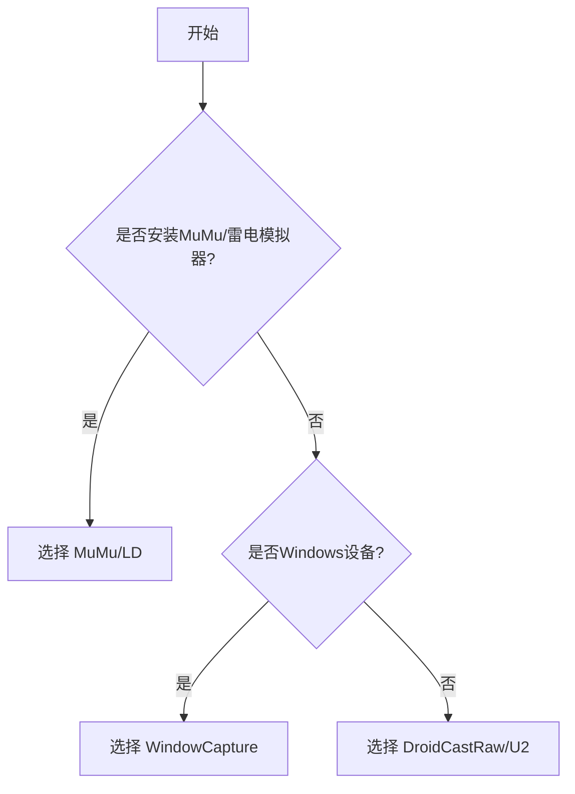

# XUAN（Xuan's UltilityAutoNaruto）

### [火影忍者自动化日常工具](https://github.com/XBJF-X/Xuan-s-UltilityAutoNaruto)

## 项目原理

基于**图像检测**识别信息+最小堆调度器自动调度任务
**（不涉及任何读取和修改游戏内存数据！）**
### 参考项目：
- [Alas（截图和控制方案来源）](https://github.com/LmeSzinc/AzurLaneAutoScript)
- [DroidCastRaw](https://github.com/Torther/DroidCast_raw)
- [EmulatorExtras](https://github.com/MaaXYZ/EmulatorExtras)

## 特点

- **支持主流模拟器分辨率**
  - 2560x1440
  - 1920x1080
  - **1600x900（开发所用分辨率，准确度最好）**
  - 1280x720
- **可视化自定义键位**
- **可视化选择模拟器端口（串口）**

# Todo

### 每日任务

- [x] 登录奖励
- [x] 排行榜点赞
- [x] 每月签到
- [x] 购买体力（可自定义次数）
- [x] 金币招财（可自定义次数）
- [x] 小队突袭（可自定义次数）
- [x] 组织祈福（适配超影/普通玩家）
- [x] 好友体力
- [x] 普通忍者招募
- [x] 每日分享
- [x] 丰饶之间（适配超影/普通玩家）
- [x] 任务集会所（超影收益暂未最大化）
- [x] 一乐外卖
- [x] 每日胜场（支持自定义个人键位，识别对局自动启停，并处理对手大退的情况）
- [x] 生存挑战
- [x] 秘境探险
- [x] 商城奖励（每天15000铜币的蚊子腿，抠门魔方还要玩家自己点）
- [x] 情报站 100 活跃度
- [x] 冒险副本
- [x] 活跃度奖励
- [x] 清空邮件

### 每周任务

- [x] 每周胜场
- [ ] 更多玩法
- [x] 忍法帖点赞分享
- [x] 修行之路
- [ ] 团本
- [ ] 本服要塞战
- [ ] 叛忍来袭
- [ ] 天地战场

### 每月任务

- [ ] 跨服要塞战
- [ ] 跨服争霸
- [x] 赛季胜场

### 周期任务

- [x] 装备合成
- [x] 高级忍者招募

### 使用体验

- [ ] 配置隔离（可管理多个账号进度）
- [x] 自动更新（使用Github托管，请保证自己的网络可以连接到Github）
- [x] 免覆盖更新配置

## 截图与控制方案

### 截图方案

|                           方案                           | 描述                       | 速度(ms) | 要求                                             |
| :------------------------------------------------------: | -------------------------- | :------: | ------------------------------------------------ |
| [DroidCastRaw](https://github.com/Torther/DroidCast_raw) | 模拟器通用方案             |  70-100  | 窗口可遮挡 可最小化                           |
|                      WindowCapture                       | Windows 系统通用方案       |  10-30   | 窗口可遮挡 **不可最小化** **窗口不可过小** |
|                            U2                            | uiautomator2 模拟器通用 |  70-100  | 窗口可遮挡 可最小化                           |
|     [MuMu](https://github.com/MaaXYZ/EmulatorExtras)     | MuMU 内置接口              |   5-10   | **安装 MuMu 12** 窗口可遮挡 可最小化       |
|      [LD](https://github.com/MaaXYZ/EmulatorExtras)      | 雷电内置接口               |   5-10   | **安装雷电** 可遮挡 可最小化               |

### 控制方案

|                       方案                        | 描述       | 延迟(ms) |
| :-----------------------------------------------: | ---------- | :------: |
|                        ADB                        | 模拟器通用 |   未测   |
|                        U2                         | 模拟器通用 |   未测   |
| [MiniTouch](https://github.com/openstf/minitouch) | 还在适配   |   未测   |

# 快速上手

### 如果电脑模拟器网络连接差/频繁加载中，则大部分功能都会异常（真入投的）

## *安装*
### 请保证自己的网络可以连接到Github！！！

下载Release中的**最新**安装包，安装路径最好选在**非C盘位置** 
程序会自动配置虚拟Python环境，下载所需要的依赖库 
第一次会拉取本仓库的master分支，下载所有需要的资源 
此后更新只需要点击主页中的**检查更新**即可，自动跟踪master分支的最新情况

## *助手设置*

### 控制模式

**控制模式**现在只有**U2**最完善，建议选择 
选完点击**串口列表**，点击当前模拟器对应的**串口**，配置完成

### 截图模式

**截图模式**按照下面流程，根据自身情况选择： 

如果选择的是**MuMu/LD**，则需要配置对应的安装路径以及实例索引

- 安装路径：
  - **MuMu**模拟器的安装路径，其下要有**shell**文件夹
  - **雷电**模拟器的安装路径，其下要有**ld.exe**
- 实例索引：
  - 打开对应模拟器的多开器，正在使用的模拟器是第 1 个，索引就是 0，依次类推

### 调度设置

**扫描间隔**默认 1000ms 即可

### 连点键位

配置完**控制模式**和**截图模式** 
进入游戏内**训练场** 
点击**键位设置** 
点击右侧**配置**按钮 
参照右侧介绍，把弹出窗口中的技能按钮拖到对应位置 
点击**结束**

### 二级密码

二级密码必须 6 位，在本地存储不会上传
建议配置二级密码，否则以下任务异常：

- **购买体力**
- **金币招财**（次数大于 2，小于等于 2 无影响）
- **小队突袭**（收取四倍收益，次数大于 0）

## *任务设置*

根据自己的需要配置以下任务参数

- **购买体力**—购买体力次数
- **金币招财**—招财次数
- **小队突袭**—四倍奖励配置
- **装备合成**—目标装备选择

## *调度*

配置完上述设置之后，请启用**所有想启用**的任务 
截图模式如果性能过弱（大于 50ms）不建议开启任务

- **每日胜场**

然后把**一切任务**交给 XUAN 的调度器来调度!!! 
（如果需要使用模拟器，请**暂停**调度器，调度器支持中断再启用）
# Bug反馈
## 首选
把XUAN安装路径下**log文件夹打包成压缩包**发送到**3034160006@qq.com**并**附上Bug表现**，这是最有可能获得开发者即时反馈的渠道（因为作者懒得上Github）

## Issue

- 如果一定要发布Issue，请不要发布诸如**xxx怎么卡了**，**为什么模拟器没有反应**诸如此类的Issue
- 首选说明是哪个具体功能
- 其次说明异常表现，比如模拟器停在哪个画面，或者模拟器在某几个画面之间一直来回跳转
- 如果有对应的日志文件最好贴上