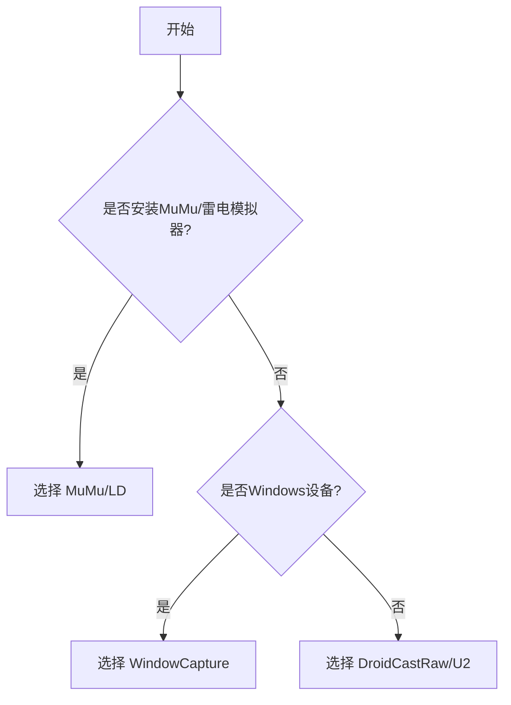

# XUAN（Xuan's UltilityAutoNaruto）

### [火影忍者自动化日常工具](https://github.com/XBJF-X/Xuan-s-UltilityAutoNaruto)

## 项目原理

基于**图像检测**识别信息+最小堆调度器自动调度任务
**（不涉及任何读取和修改游戏内存数据！）**
### 参考项目：
- [Alas（前端样式，截图和控制方案）](https://github.com/LmeSzinc/AzurLaneAutoScript)
- [Mower-ng（任务执行流程和场景跳转）](https://git.zhaozuohong.vip/mower-ng/mower-ng)
- [DroidCastRaw](https://github.com/Torther/DroidCast_raw)
- [EmulatorExtras](https://github.com/MaaXYZ/EmulatorExtras)

## 特点

- **支持主流模拟器分辨率**
  - 2560x1440
  - 1920x1080
  - **1600x900（开发所用分辨率，准确度最好）**
  - 1280x720
- **可视化自定义键位**
- **可视化选择模拟器端口（串口）**

# Todo

### 每日任务

- [x] 登录奖励（自动启动火影忍者，领取奖励，无额外条件）
- [x] 排行榜点赞（跳转至排行榜点赞，无额外条件）
- [x] 每月签到（跳转到活动-每月签到进行签到，无额外条件）
- [x] 购买体力（自定义次数，**需要填写二级密码，以及保证有足够金币**）
- [x] 金币招财（自定义次数，**需要填写二级密码，以及保证有足够金币**）
- [x] 小队突袭（自定义收取四倍次数，**需要填写二级密码，以及保证有足够金币**）
- [x] 组织祈福（跳转到组织祈福进行祈福并领取昨日奖励，适配超影/普通玩家，无额外条件）
- [x] 好友体力（跳转到好友界面领取体力，无额外条件）
- [x] 普通忍者招募（跳转到招募进行普通忍者招募，无额外条件）
- [x] 每日分享（**需要模拟器安装QQ/微信**）
- [x] 丰饶之间（适配超影/普通玩家，**需设置键位**）
- [x] 任务集会所（每一个小时检查任务，收取并接取下一个任务，简单的接取所有任务，**收益暂未最大化**）
- [x] 一乐外卖（11点自动收取体力，并执行**装备合成**任务）
- [x] 每日胜场（自动刷胜场直到今日所有宝箱领取完成，支持自定义个人键位，支持自动追回宝箱，**需要关闭“只匹配玩家”**，**需设置键位**）
- [x] 生存挑战（自动扫荡/重置，**建议战力足够扫荡到15关的开启，否则收益不如手打**）
- [x] 秘境探险（不停刷落岩/烈炎/罡体/水牢/雷霆秘境，直到用完所有探险券）
- [x] 商城奖励（每天15000铜币的蚊子腿，抠门魔方还要玩家自己点）
- [x] 情报站 100 活跃度（自动完成情报站的活跃任务并领取奖励，无附加条件）
- [x] 冒险副本（自动扫荡上次扫荡的副本，**如果未扫荡则全选**）
- [x] 活跃度奖励（自动收取所有已到达的活跃度）
- [ ] 积分赛奖励（自动收取积分赛每日的奖励）
- [x] 清空邮件（一键提取邮件，**最好在设置里设置好哪些物品（如体力/饰品/忍具）不被一键收取**）

### 每周任务

- [x] 每周胜场（自动刷胜场直到周胜满，**需要自己领取周胜奖励**，程序只负责刷胜场，**需要关闭“只匹配玩家”**，**需设置键位**）
- [x] 更多玩法（自动刷绝迹战场/大蛇丸试炼至满积分，**需要自己领取奖励**，程序只负责刷积分）
- [x] 忍法帖点赞分享（自动给忍法帖排行榜点赞并分享，**需要模拟器安装QQ/微信**）
- [x] 修行之路（自动扫荡/重置修行之路，适配超影/普通玩家）
- [ ] 团本
- [x] 本服要塞战（自动在火之要塞刷取积分，建议不要带毅力等任何会拖慢刷取速度的密卷，**需设置键位**）
- [ ] 叛忍来袭
- [x] 天地战场

### 每月任务

- [ ] 跨服要塞战
- [ ] 跨服争霸
- [x] 赛季胜场（自动刷胜场直到赛季胜场满，**需要自己领取奖励**，程序只负责刷胜场，**需要关闭“只匹配玩家”**）

### 周期任务

- [x] 装备合成（下午5点之前每50体力扫荡一次装备，5点时扫荡最后一次，留体力给第二天扫荡精英副本，**需要设置要扫荡的装备部位**）
- [x] 高级忍者招募（每两天自动招募一次高级忍者招募，无额外条件）

### 活动任务

- [ ] 纲手的挑战
- [ ] 天天爱美食
- [ ] 药草大冒险
- [ ] 钓鱼大会
- [ ] 烟花红包
- [x] 无差别预选赛（可选7场参与/自己打6次胜场后程序刷满30场）

### 使用体验

- [x] 配置隔离（可管理不同账号进度）
- [x] 多开（上限与个人电脑性能挂勾，作者只测试过3开）
- [x] 自动更新（使用Github托管，请保证自己的网络可以连接到Github）
- [x] 免覆盖更新配置

## 截图与控制方案

### 截图方案

|                           方案                           | 描述                       | 速度(ms) | 要求                                             |
| :------------------------------------------------------: | -------------------------- | :------: | ------------------------------------------------ |
| [DroidCastRaw](https://github.com/Torther/DroidCast_raw) | 模拟器通用方案             |  70-100  | 窗口可遮挡 可最小化                           |
|                      WindowCapture                       | Windows 系统通用方案       |  10-30   | 窗口可遮挡 **不可最小化** **窗口不可过小** |
|                            U2                            | uiautomator2 模拟器通用 |  70-100  | 窗口可遮挡 可最小化                           |
|     [MuMu](https://github.com/MaaXYZ/EmulatorExtras)     | MuMU 内置接口              |   5-10   | **安装 MuMu 12** 窗口可遮挡 可最小化       |
|      [LD](https://github.com/MaaXYZ/EmulatorExtras)      | 雷电内置接口               |   5-10   | **安装雷电** 可遮挡 可最小化               |

### 控制方案

|                       方案                        | 描述       | 延迟(ms) |
| :-----------------------------------------------: | ---------- | :------: |
|                        ADB                        | 模拟器通用 |   未测   |
|                        U2                         | 模拟器通用 |   未测   |
| [MiniTouch](https://github.com/openstf/minitouch) | 还在适配   |   未测   |

# 快速上手

### 如果电脑模拟器网络连接差/频繁加载中，则大部分功能都会异常（真入投的）

## *安装*
### 请保证自己的网络可以连接到Github！！！

下载Release中的**最新**安装包，安装路径最好选在**非C盘位置** 
程序会自动配置虚拟Python环境，下载所需要的依赖库 
第一次会拉取本仓库的master分支，下载所有需要的资源 
此后更新只需要点击主页中的**检查更新**即可，自动跟踪master分支的最新情况

## *助手设置*

### 控制模式

**控制模式**现在只有**U2**最完善，建议选择 
选完点击**串口列表**，点击当前模拟器对应的**串口**，配置完成

### 截图模式

**截图模式**按照下面流程，根据自身情况选择： 

如果选择的是**MuMu/LD**，则需要配置对应的安装路径以及实例索引

- 安装路径：
  - **MuMu**模拟器的安装路径，其下要有**shell**文件夹，具体可以看下面QA中的实例路径
  - **雷电**模拟器的安装路径，其下要有**ld.exe**
- 实例索引：
  - 打开对应模拟器的多开器，正在使用的模拟器是第 1 个，索引就是 0，依次类推

### 调度设置

**扫描间隔**默认 1000ms 即可

### 连点键位

配置完**控制模式**和**截图模式** 
进入游戏内**训练场** 
点击**键位设置** 
点击右侧**配置**按钮 
参照右侧介绍，把弹出窗口中的技能按钮拖到对应位置 
点击**结束**

### 二级密码

二级密码必须 6 位，在本地存储不会上传
建议配置二级密码，否则以下任务异常：

- **购买体力**
- **金币招财**（次数大于 2，小于等于 2 无影响）
- **小队突袭**（收取四倍收益，次数大于 0）

## *任务设置*

根据自己的需要配置以下任务参数

- **购买体力**—购买体力次数
- **金币招财**—招财次数
- **小队突袭**—四倍奖励配置
- **消耗体力**—优先采用哪种方式消耗体力，以及目标装备选择

## *调度*

配置完上述设置之后，请启用**所有想启用**的任务 
然后把**一切任务**交给 XUAN 的调度器来调度!!! 
（如果需要使用模拟器，请**暂停**调度器，调度器支持中断再启用）
# Bug反馈
## 首选
把XUAN安装路径下**log文件夹打包成压缩包**发送到**3034160006@qq.com**并**附上Bug表现**，这是最有可能获得开发者即时反馈的渠道（因为作者懒得上Github）

## Issue

- 如果一定要发布Issue，请不要发布诸如**xxx怎么卡了**，**为什么模拟器没有反应**诸如此类的Issue
- 首选说明是哪个具体功能
- 其次说明异常表现，比如模拟器停在哪个画面，或者模拟器在某几个画面之间一直来回跳转
- 如果有对应的日志文件最好贴上

# 常见问题（Q&A）

### Q：串口号怎么看

    首先，可以使用设置的串口选择，会自动列出可用的adb设备，但是MuMu模拟器的设备使用adb devices无法列出，需要自己填写，操作如下：
    打开你安装火影忍者的那个模拟器，点进设置的设备诊断，往下翻可以找到端口号，格式为5xxx 16xxx
    左侧5xxx代表串口号“emulator-5xxx”
    右侧16xxx代表串口号“127.0.0.1:16xxx”
    其中xxx是动态分配的，请按照自己的情况填写，最好使用127.0.0.1:16xxx的格式填写，因为u2库连接adb设备的时候似乎找不到emulator-5xxx这种串口，会报错not online
    雷电模拟器类似，但区别是两种格式的端口号都可以填写

### Q：报错模拟器连接错误
    这种多半是安装路径填写错误导致的，对于MuMu模拟器，填写最顶层的安装目录即可，如"D:\Program Files (x86)\MuMuPlayer-12.0"
    不需要填写子目录如"D:\Program Files (x86)\MuMuPlayer-12.0\nx_device\12.0"或者"D:\Program Files (x86)\MuMuPlayer-12.0\nx_main"之类的，交给程序自动处理即可
    雷电模拟器填写类似"D:/Program Files (x86)/leidian/LDPlayer9"的路径即可

### Q：模拟器实例索引怎么填写
    按照模拟器多开中给出的顺序填写，比如MuMu的模拟器索引需要在模拟器列表缩略图的左上角#0，#1，#2，这就是实例索引
    雷电模拟器也在多开的模拟器列表中模拟器信息的最左侧一列可以找到

### Q：调度器启动后游戏黑屏重启怎么回事
    由于火影忍者5点后刷新登录奖励但不会自动弹出，需要手动重新登陆游戏才能领取，所以我设置了一个登陆奖励的任务，每天5点20秒自动执行重启游戏的任务
    如果你当天已经领取过可以关闭该任务，如果没有，则开启该任务需要保证账号已登录，即：打开游戏后一路加载直到开始游戏按钮出现，这样该任务才能正常执行